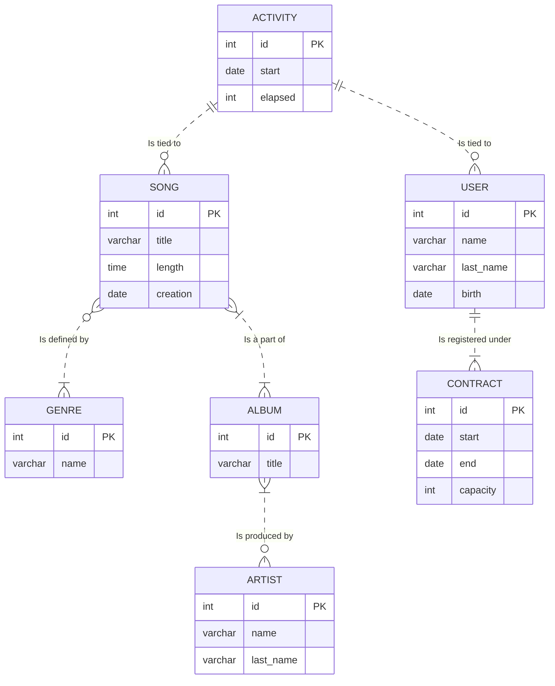

Symbols representing cardinalities in the schema:

| Symbols  | Cardinality |
|----------|-------------|
| o\|      | 0, 1        |
| o}       | 0, n        |
| \|       | 1, 1        |
| \|}      | 1, n        |

